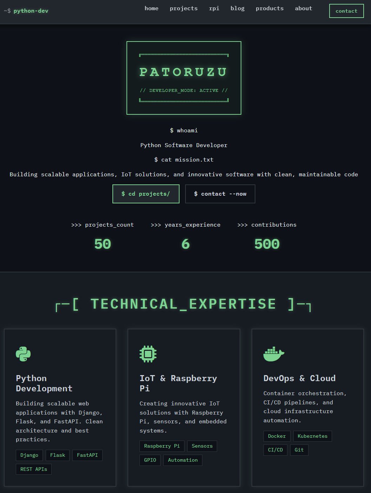

# Python Developer Portfolio

A **production-minded Flask portfolio platform** with Docker deployment, Celery background jobs, newsletter subscriptions, admin management, and **external payment links (no PCI scope)**.

> Built to demonstrate real-world backend practices: configuration validation, security hardening, background jobs, tests, and CI-ready workflows.



---

## ✨ Highlights

- 📝 **Blog** — Markdown posts with syntax highlighting
- 📧 **Newsletter** — subscription management + email sending
- 🛒 **Products** — external payment links (Stripe/PayPal/Gumroad/etc.)
- 🔌 **Raspberry Pi Projects** — IoT showcase section
- 🔐 **Admin/auth workflows** — multi-admin support + recovery codes
- ⚡ **Background processing** — Celery tasks for async work (emails, jobs)
- 🗄️ **Data layer** — SQLAlchemy 2.0 models; SQLite dev → PostgreSQL production
- 🔒 **Security** — CSP, CSRF protection, bcrypt password hashing, rate limiting, secure headers
- 🐳 **Docker-first** — local dev and production-like runs
- 🧪 **Tests** — **579 tests, 81.5%+ coverage** with comprehensive test suite
- 🐳 **Deployment** — Docker + Compose, production guidance + checklists
- 🔐 **Secrets management** — `.env` for dev, **Doppler** for production

---

## ✅ Requirements

- **Python 3.x**
- **Docker + Docker Compose** (recommended path)
- **Make** (optional, for convenience commands)

---

## 🚀 Quick Start (Docker Recommended)

```bash
# 1) Configure environment
cp .env.example .env
# Edit .env with your settings (dev-only values are fine)

# 2) Start services
make docker-up

# 3) Open the app
# Website: http://localhost:5000
# Admin:   http://localhost:5000/admin/login
````

### Optional: Validate configuration

If you're running locally (not inside Docker), install dependencies first and then validate:

```bash
pip install -r requirements.txt
python validate_config.py
```

> Demo/admin credentials are **development-only** and are documented in `.env.example`.
> **Production requires credentials via environment variables (no defaults).**

---

## 🧰 Manual Setup (Local)

```bash
# 1) Install dependencies
pip install -r requirements.txt

# 2) Run migrations / initialise DB
python scripts/update_database.py

# 3) Start Flask
python app.py

# 4) Start Celery worker (separate terminal)
celery -A celery_config.celery worker --loglevel=info --pool=solo
```

---

## 🔐 Admin Access

```text
Admin login: http://localhost:5000/admin/login
```

* **Development demo credentials:** see `.env.example`
* **Production:** set admin credentials via environment variables and store secrets in Doppler (recommended) or your deployment environment.

Create an admin user:

```bash
make create-admin
```

### Recovery codes (overview)

Recovery codes let you reset admin access if you lose credentials.

* Generate codes from the Admin Dashboard: `/admin/security`
* Codes are **shown once** — store them securely
* Each code is **single-use**

Full details: see `docs/LOGIN_GUIDE.md`.

---

## ⚙️ Configuration & Secrets

Configuration is centralised in `config.py` and supports:

* `.env` files for local development
* **Doppler** for production secrets

Validate your setup any time:

```bash
python validate_config.py
```

### Doppler (recommended for production)

```bash
doppler login
doppler setup

doppler run -- python app.py
doppler run -- python validate_config.py
```

Full reference: `docs/CONFIG.md`.

---

## 📚 Documentation

* `docs/CONFIG.md` — environment variables + Doppler integration ⭐
* `docs/SETUP_GUIDE.md` — detailed setup
* `docs/QUICK_REFERENCE.md` — common commands
* `docs/TESTING.md` — tests and coverage
* `docs/DEPLOYMENT.md` — deployment guidance
* `docs/CELERY_QUICKSTART.md` — background jobs
* `docs/DEPLOYMENT_CHECKLIST.md` — pre-deploy checklist
* `docs/LOGIN_GUIDE.md` — admin authentication and recovery
* `docs/ADMIN_CRUD_COMPLETE.md` — admin management walkthrough

---

## 🛠️ Tech Stack

* **Backend:** Flask 3.0, SQLAlchemy 2.0, Celery 5.3
* **Database:** SQLite (dev) → PostgreSQL (production)
* **Queue/Cache:** Redis 7
* **Testing:** pytest (**579 tests**), **81.5%+ coverage**
* **Security:** CSP, CSRF, bcrypt, rate limiting, security headers
* **Deployment:** Docker, nginx (optional), GitHub Actions (CI-ready)

> CI details depend on your workflow config—see `.github/workflows/` for what runs in your repo.

---

## 📋 Useful Commands

```bash
make help              # Show all commands
make docker-up         # Start services
make docker-down       # Stop services
make backup            # Show backup command (Windows: use PowerShell script)
make restore           # Show restore instructions
make list-backups      # Show backup list command
make test              # Run tests
make create-admin      # Create admin user
make generate-password # Generate admin password hash
make reset-admin       # Reset admin credentials
make cache-bust        # Generate static asset manifest
make placeholders      # Generate placeholder images
```

### 🔄 Database Backups (Windows PowerShell)

For Windows users, use the PowerShell backup script:

```powershell
# Create a timestamped backup
.\scripts\db-backup.ps1 backup

# List all backups
.\scripts\db-backup.ps1 list

# Restore from backup (interactive)
.\scripts\db-backup.ps1 restore

# Create auto-backup
.\scripts\db-backup.ps1 auto-backup
```

**Quick PowerShell Commands:**
```powershell
# Manual backup with custom name
Copy-Item instance/portfolio.db backups/my-backup.db

# List all backups
Get-ChildItem backups/*.db | Sort-Object LastWriteTime -Descending

# Restore from specific backup
Copy-Item backups/[filename].db instance/portfolio.db -Force
```

---

## 🌐 API Endpoints (selected)

```text
POST /api/contact
POST /api/newsletter/subscribe
GET  /api/projects
GET  /api/blog
GET  /health
```

---

## 💳 Payment Links (No PCI Scope)

Products support external payment links (examples):

* PayPal: `https://paypal.me/...`
* Stripe: `https://buy.stripe.com/...`
* Gumroad: `https://gumroad.com/l/...`

No payment processing is handled by this app.

---

## 🔒 Security Notes

Security controls include CSP, CSRF protection, bcrypt password hashing, rate limiting, and secure headers.

**Production expectations:**

* Use strong secrets (prefer Doppler)
* Enable HTTPS at the edge (reverse proxy / platform)
* Configure secure cookies and HSTS (see `docs/DEPLOYMENT.md`)

---

## 🧪 Testing

The project maintains high test coverage with comprehensive test suites covering all major functionality:

```bash
make test
pytest tests/ --cov=. --cov-report=html
```

### Test Coverage Summary

**Overall Coverage: 81.5%** (579 tests, 100% passing)

#### Module Coverage Highlights
- ✅ **Routes:** 10+ modules at 96-100% coverage
  - Admin Settings: 100%
  - Admin Products: 100%
  - Admin Projects: 96%
  - Admin Blog: 99%
  - API Routes: 100%
  - GDPR Routes: 100%
  - Public Routes: 100%

- ✅ **Services:** Near-perfect coverage
  - Blog Service: 98%
  - Project Service: 100%
  - Newsletter Service: 100%

- ✅ **Utilities:** High reliability
  - Analytics Utils: 90%
  - DB Optimizer: 94%
  - Video Utils: 91%
  - Upload Security: 79%

#### Test Suite Composition
- **Unit Tests:** Core functionality and business logic
- **Integration Tests:** Route handlers, database operations
- **Service Tests:** Email, newsletter, blog, project services
- **API Tests:** JSON endpoints, error handling
- **GDPR Tests:** Data export, deletion, cookie consent
- **Admin Tests:** Authentication, CRUD operations
- **Security Tests:** CSRF protection, input validation
- **Utility Tests:** Analytics, CSP, rate limiting

For detailed testing documentation, see `docs/TESTING.md`.

---

## 🐛 Troubleshooting

* Port conflicts (Redis / DB): stop local services or run via Docker
* DB resets: run `python scripts/update_database.py`
* Docker rebuild: `make docker-down` then rebuild images

Full troubleshooting: see `docs/SETUP_GUIDE.md`.

---

## 📝 License

MIT — see `LICENSE`.

---

## 📬 Contact

* GitHub: `https://github.com/Patoruzuy`
* Email: `patoruzuy@tutanota.com`

**Version:** 2.1.0
**Last Updated:** February 19, 2026
**Test Coverage:** 81.5% (579 tests)

